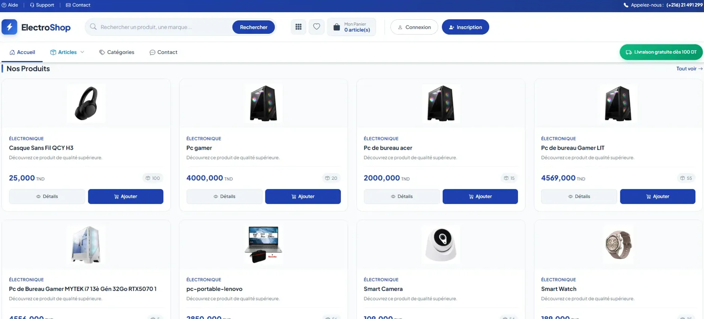

# 🛒 ElectroShop - E-Commerce Platform

Une plateforme e-commerce complète développée avec ASP.NET Core MVC et Bootstrap.

## 📸 Captures d'écran




## 🚀 Technologies utilisées

- **Backend:** ASP.NET Core MVC 6.0
- **Frontend:** Bootstrap 5, CSS3, JavaScript
- **Base de données:** SQL Server + Entity Framework Core
- **Authentification:** ASP.NET Identity

## ⚡ Fonctionnalités

- ✅ Catalogue de produits avec filtrage par catégories
- ✅ Panier d'achat dynamique
- ✅ Système de commande complet
- ✅ Authentification et gestion des utilisateurs
- ✅ Tableau de bord administrateur
- ✅ Design responsive

## 🛠️ Installation

1. Cloner le repository
```bash
git clone https://github.com/Amalabedal22/ElectroShop.git
```

2. Ouvrir avec Visual Studio 2022

3. Mettre à jour la connection string dans `appsettings.json`

4. Exécuter les migrations
```bash
Update-Database
```

5. Lancer l'application

## 👩‍💻 Auteur

**Amal Benabdelghaffar**
- GitHub: [@Amalabedal22](https://github.com/Amalabedal22)
- LinkedIn: [Amal Benabdelghaffar](votre-lien-linkedin)

## 📝 License

Ce projet est sous licence MIT.